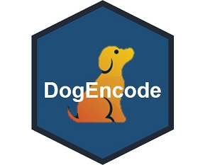

DogEncode  
================

*DogEncode* provides some methods to encode categoical features fast and easy. From simple methodology like dummy variables to Owen Zhang's kaggle famous leave one out encoding, this R package will cover them all.   


## Installation

```s
# install.packages("devtools")
devtools::install_github("germayneng/DogEncode")
```
## Usage

Currently, DogEncode covers the following encoding methods. I will be glad to add more as I learn more :) 
1) one hot encoding (dummy)

```s
# feed in dataframe wtih cat variables. class of variables to be character 
# mode = auto to automate dropping off one dummy 
# mode = manual to generate all dummy 
one_hot_encoding(df, mode = "manual") 
```

2) label encoding aka colhot encoding 
3) Count encoding aka counthot encoding 
4) Label count encoding 
5) Leave one out encoding

## To do

* Add more documentation to explain every function and credit to respective people.  
* Hash encoding

## Credit 

Owen Zhang, HJ van Veen, Dex Grooves and [Simone Aiosa's dog logo](https://dribbble.com/shots/2673237-Dog)
<br>
[super helpful post to help debug ^.^](http://alyssafrazee.com/2014/01/21/namespaces.html)

## License 
